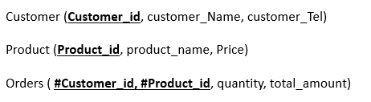
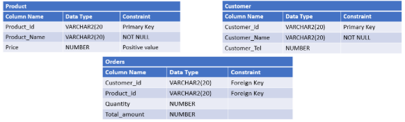

# Cheickpoint DDL

Dans ce point de contrôle, nous avons le modèle relationnel suivant :

Et leurs tableaux avec les types de données correspondants :

Instructions :

Il vous est demandé de créer le modèle relationnel ci-dessus en utilisant le langage SQL et en fonction des différentes contraintes mentionnées.
Après avoir créé des tables, écrivez des commandes SQL dans :
Ajoutez une colonne Catégorie (VARCHAR2(20)) à la table PRODUCT.
Ajoutez une colonne OrderDate (DATE) à la table ORDERS qui a SYSDATE comme valeur par défaut.
