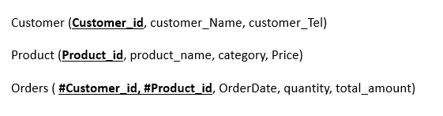

# Checkpoint DML

Dans ce point de contrôle, nous avons créé le modèle relationnel suivant. Il faut maintenant insérer les données dans les différentes tables en utilisant le langage DML :

__Instructions__

Écrivez des commandes SQL pour insérer les lignes suivantes dans les tables correspondantes

